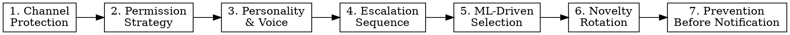
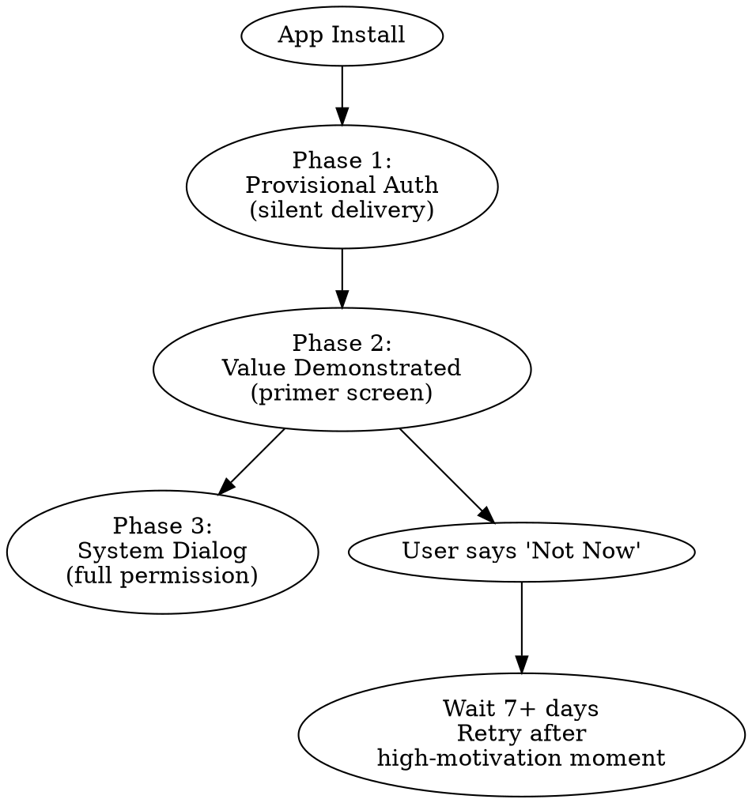
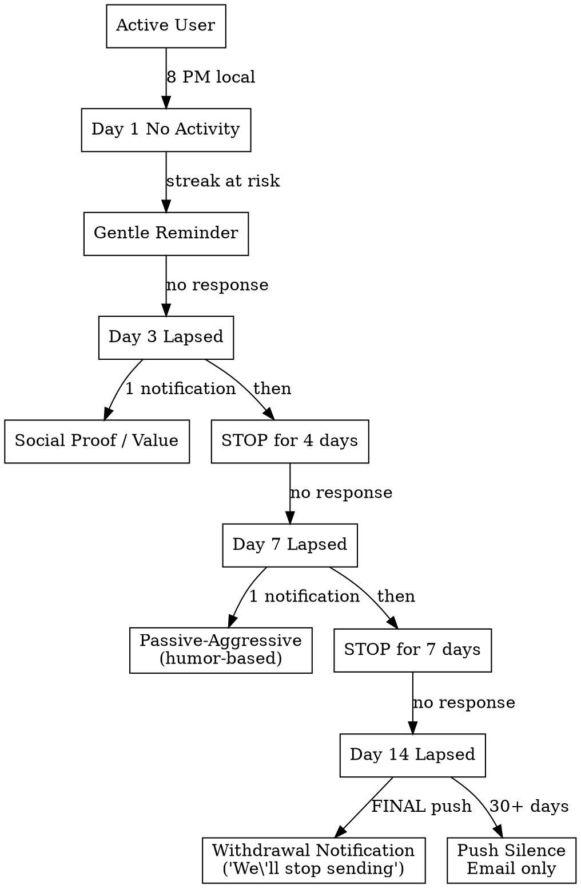

# App Engagement Notifications

## Overview

Bulletproof cross-platform notification system modeled on Duolingo's proven retention strategy. Core principle: **notifications are a protected long-term asset** — channel health beats short-term engagement metrics. Oversending causes permanent audience loss.

This skill covers the full stack: iOS/Android technical implementation, permission strategy, message psychology, escalation sequences, ML-driven optimization, and re-engagement flows.

## When to Use

- Building push notifications for any consumer app
- Improving retention/re-engagement for existing notification system
- iOS notification delivery is unreliable or opt-in rates are low
- Users are churning despite receiving notifications
- Notification opt-out rate is climbing
- Need to implement streak, gamification, or habit-forming mechanics
- Designing notification copy and escalation sequences

## The Duolingo Model — 7 Pillars



### 1. Channel Protection (Non-Negotiable)

Treat your notification opt-in audience as a finite, non-renewable resource.

**Hard Rules:**
- Max 1-2 notifications/day per user (Duolingo rarely exceeds 1)
- Minimum 4-hour gap between any two notifications
- Never send between 9 PM - 7 AM user local time (server-enforced, not client)
- Monitor opt-out rate weekly — if it exceeds 0.5%/week, reduce volume immediately
- Track "notification fatigue score" per user: consecutive ignored notifications
- After 5 consecutive ignored notifications, reduce frequency by 50%
- After 10 consecutive ignored, pause and trigger the "withdrawal" tactic (see Escalation)

**Server-Side Enforcement:** Never rely on client-side scheduling alone. If app is uninstalled or unopened, local notifications don't fire. All engagement notifications must be server-triggered.

### 2. Permission Strategy — iOS is the Battleground

iOS only gives you ONE shot at the system permission dialog. Blow it and you're dead.

**The Three-Phase Approach:**



**Phase 1 — Provisional Authorization (iOS 12+):**

Start with provisional — no dialog shown, notifications delivered silently to Notification Center. Users see value before committing.

```swift
UNUserNotificationCenter.current().requestAuthorization(
    options: [.alert, .badge, .sound, .provisional]
) { granted, error in
    if granted {
        DispatchQueue.main.async {
            UIApplication.shared.registerForRemoteNotifications()
        }
    }
}
```

Key states to track:
- `.notDetermined` — haven't asked yet
- `.provisional` — silent delivery, user can promote or dismiss
- `.authorized` — full permission granted
- `.denied` — user declined (must go to Settings to reverse)
- `.ephemeral` — App Clips only

**Phase 2 — Primer Screen (After Value Moment):**

Show a custom in-app screen BEFORE triggering the system dialog. This screen:
- Explains what notifications they'll receive (specific examples)
- Shows the benefit ("Never accidentally break your streak")
- Has a "Not Now" option (never trap the user)
- Full-screen primers outperform modals by 30-35%
- Trigger after first meaningful interaction (first workout, first lesson, first purchase)

Primer screens can increase opt-in rates from 35% to 60%+.

**Phase 3 — System Dialog:**

Only triggered after user taps "Yes" on your primer screen.

**Re-prompt Strategy (When Denied):**
- Wait minimum 7 days
- Only show during high-motivation moment (after completing a workout, hitting a milestone)
- Show as subtle in-app banner, never a blocking modal
- Link directly to app's Settings page
- Max 1 re-prompt per 30 days

**Android Note:** Android 13+ requires `POST_NOTIFICATIONS` runtime permission. Same primer strategy applies. Pre-13 devices get notifications by default.

### 3. Personality & Voice — The Mascot Pattern

Duolingo's Duo owl creates an emotional relationship that makes notifications feel personal, not corporate.

**Implementing a notification persona:**
- Give notifications a consistent character voice (playful, supportive, slightly cheeky)
- Use first-person from the character: "I noticed you haven't..." not "You haven't..."
- Personality makes guilt-based re-engagement feel lighthearted, not manipulative
- Character can express "emotions": happy when user succeeds, sad when they lapse

**Copy Tone Spectrum:**

| User State | Tone | Example |
|---|---|---|
| Active, on streak | Celebratory | "5 days straight — you're on fire" |
| Approaching risk | Supportive | "Still time today — even 5 minutes counts" |
| 1-day lapse | Gentle nudge | "Hey, we missed you yesterday" |
| 3-day lapse | Mild guilt | "Your streak is gone... but you can start a new one" |
| 7-day lapse | Passive-aggressive humor | "Go on, keep scrolling. I'll wait." |
| 14-day lapse | Withdrawal | "These reminders don't seem to be working. We'll stop sending them." |

The **withdrawal notification** is Duolingo's most powerful tactic — threatening to stop contact creates urgency through loss aversion.

### 4. Escalation Sequence

Not all lapsed users get the same message. Escalation is time-based and state-aware.



**Critical Rule:** Gaps between escalation steps are mandatory. Never send consecutive re-engagement notifications without a multi-day pause. The pause itself creates anticipation.

**After 30 days lapsed:** Stop push entirely. Move to email-only. Continuing push drives uninstalls and APNs complaints which damage sender reputation permanently.

### 5. ML-Driven Message Selection (Bandit Algorithm)

Duolingo uses bandit algorithms to select the best notification from a pool of pre-written templates per user segment.

**Implementation approach:**
1. Write 15-30 notification templates per trigger type
2. Use a multi-armed bandit (Thompson Sampling or UCB1) to test which templates drive action
3. Score notifications only against others sent to the same user segment
4. Track "action taken" (e.g., workout logged), not just "app opened" — app opens are vanity
5. Demote recently-seen templates to prevent repetition fatigue (see Novelty Rotation)
6. Language/locale affects effectiveness — template that works for one audience may not for another

**Minimum Viable Version (no ML required):**
- Create 5+ templates per notification type
- Randomly select, track conversion per template
- After 1000 sends per template, disable bottom performers
- Rotate new templates in monthly

### 6. Novelty Rotation

Notification fatigue is the #1 killer. Same message repeated = invisible.

**Rules:**
- Never send the same template to the same user within 14 days
- Track per-user template history
- New templates get an initial boost (Duolingo found novel messages outperform by 2-3x initially)
- Gradually demote templates with declining engagement
- Refresh template pool monthly with new copy
- Seasonal/timely templates (New Year, summer) spike engagement

### 7. Prevention Before Notification

Duolingo's streak freeze is genius — it prevents churn before notifications are even needed.

**In-app prevention mechanics:**
- **Streak Freeze/Shield:** Let users protect their streak for one day (earned or purchased)
- **Flexible Goals:** Allow users to reduce daily commitment instead of breaking streak
- **Progress Bars:** Visual urgency in-app ("3 hours left to maintain streak")
- **Evening Check-in:** In-app prompt at 8 PM if daily goal not met, before sending push

Reduce notification load by solving the problem in-app first. Every notification you don't send protects channel health.

**Implementation priority:** Build prevention mechanics BEFORE building notification triggers. The best notification is the one you never had to send.

## iOS Technical Hardening

### Rich Notifications (UNNotificationServiceExtension)

Modify notification content before display. ~30 seconds processing time.

Use for:
- Adding images (progress charts, streak badges)
- Decrypting end-to-end encrypted payloads
- Downloading supplementary data
- Modifying text based on latest user state

```swift
// NotificationService.swift (in Notification Service Extension target)
class NotificationService: UNNotificationServiceExtension {
    override func didReceive(_ request: UNNotificationRequest,
                            withContentHandler contentHandler: @escaping (UNNotificationContent) -> Void) {
        guard let mutableContent = request.content.mutableCopy() as? UNMutableNotificationContent else {
            contentHandler(request.content)
            return
        }
        // Attach an image, update badge count, personalize copy
        // You have ~30 seconds before the system calls serviceExtensionTimeWillExpire
        contentHandler(mutableContent)
    }
}
```

### Notification Categories & Actions

Add actionable buttons — users engage directly from the notification without opening the app.

```swift
// Register categories at app launch
let completeAction = UNNotificationAction(
    identifier: "COMPLETE_ACTION",
    title: "Log Quick Workout",
    options: [.foreground]
)
let snoozeAction = UNNotificationAction(
    identifier: "SNOOZE_ACTION",
    title: "Remind Me Later",
    options: []
)
let streakCategory = UNNotificationCategory(
    identifier: "STREAK_REMINDER",
    actions: [completeAction, snoozeAction],
    intentIdentifiers: [],
    options: [.customDismissAction]  // Track dismissals!
)
UNUserNotificationCenter.current().setNotificationCategories([streakCategory])
```

`.customDismissAction` is critical — it tells you when users explicitly dismiss, feeding your fatigue scoring.

### Interruption Levels (iOS 15+)

```
| Level           | Use For                        | Behavior                              |
|-----------------|--------------------------------|---------------------------------------|
| .passive        | Weekly summaries, tips         | Silent, Notification Center only      |
| .active         | Daily reminders, milestones    | Sound + banner, respects Focus Mode   |
| .timeSensitive  | Streak about to expire tonight | Breaks through Focus Mode             |
| .critical       | DO NOT USE                     | Medical/safety only, Apple gates this |
```

Request `time-sensitive` entitlement early — Apple reviews it and approval can take days.

**APNs Header Requirements:** Every push must include `apns-push-type: alert` (or `background` for silent). Missing this header causes delivery failures on iOS 13+. Also set `apns-topic` to your app's bundle ID.

### Badge Count Management

Reset badge to 0 when user opens the app. A badge count of 47 on a fitness app is a reason to uninstall.

```swift
func applicationDidBecomeActive(_ application: UIApplication) {
    UIApplication.shared.applicationIconBadgeNumber = 0
}
```

### Notification Grouping

```json
{
  "aps": {
    "alert": { "title": "...", "body": "..." },
    "thread-id": "streak-reminders"
  }
}
```

Use `thread-id` to group related notifications. Use `apns-collapse-id` in the HTTP header to replace outdated notifications of the same type.

### Silent Push Limitations (Critical iOS Gotcha)

Silent push notifications (`content-available: 1` with no alert) are **NOT guaranteed on iOS.**

- iOS throttles silent push based on battery, memory, and device state
- Low Power Mode delays or drops them entirely
- If user force-quits the app, silent push will NOT wake it
- Budget: expect ~2-3 per hour maximum across ALL apps on device
- NEVER rely on silent push for user-facing features

Use silent push only for: background data sync, pre-fetching content, updating badge count silently.

### Device Token Lifecycle

- Re-register token on EVERY app launch (tokens rotate after OS updates, restores)
- Handle APNs `410 Unregistered` response: delete token immediately or face throttling
- Store multiple tokens per user (iPad + iPhone)
- Poll APNs feedback service daily for invalid tokens
- Token format differs between sandbox and production — never mix environments

### Check Permission Status on Every Foreground

```swift
func applicationDidBecomeActive(_ application: UIApplication) {
    UNUserNotificationCenter.current().getNotificationSettings { settings in
        // Sync to backend - don't send pushes to users who revoked
        APIClient.shared.updateNotificationStatus(
            authorized: settings.authorizationStatus == .authorized,
            provisional: settings.authorizationStatus == .provisional
        )
    }
}
```

## Cross-Platform Checklist

| Concern | iOS | Android |
|---|---|---|
| Permission | Single system dialog + provisional | Runtime permission (13+), default on (<13) |
| Primer screen | Required before system dialog | Required before runtime permission |
| Rich media | UNNotificationServiceExtension | FCM + custom notification layout |
| Actions | UNNotificationCategory + actions | NotificationCompat.Action |
| Grouping | thread-id + collapse-id | NotificationCompat.Group |
| Focus Mode | Interruption levels | Do Not Disturb channels |
| Delivery | APNs (HTTP/2 + JWT) | FCM (REST API) |
| Silent push | Unreliable, throttled | More reliable via FCM data messages |
| Badge | Manual management required | Auto-managed by system |
| Channels | N/A (categories only) | Notification Channels (required 8.0+) |

## Metrics to Track

**Primary (engagement):**
- Notification → Action rate (NOT just open rate)
- Daily active users who received vs didn't receive notification
- Streak continuation rate for notified vs unnotified users
- Re-engagement conversion at the "completed action" level

**Channel health (protection):**
- Weekly opt-out rate (alarm threshold: >0.5%)
- Notification fatigue score distribution
- APNs error rate (especially 410 Unregistered)
- Delivery rate by interruption level

**Optimization:**
- Per-template conversion rate
- Template novelty decay curve
- Optimal send time per user segment
- Primer screen → system dialog conversion rate

## Red Flags — You're Cutting Corners

| Excuse | Reality |
|---|---|
| "We'll add provisional auth later" | Later = never. Day 1 cold permission prompt burns your one shot. |
| "One template per trigger is fine for MVP" | Single-template = invisible within 2 weeks. Write 5 minimum. |
| "We'll track opens instead of actions" | Opens are vanity. Track the behavior you actually want (workout logged, lesson completed). |
| "Silent push can handle this" | iOS throttles/drops silent push. Never rely on it for user-facing features. |
| "Same escalation works for all users" | A power user who missed 1 day is different from a new user who used the app once. Segment. |
| "We don't need a mascot" | You don't need Duolingo's owl, but you need a consistent voice. "Your App Team" is not a voice. |
| "The withdrawal notification is manipulative" | It's the highest-converting re-engagement tactic. Respectful withdrawal is not manipulation. |

## Common Mistakes

| Mistake | Fix |
|---|---|
| Asking permission on first launch | Use provisional auth, then primer after value moment |
| Same notification copy every day | 15+ templates with novelty rotation |
| Measuring app opens, not actions | Track workout-logged, lesson-completed, purchase-made |
| No escalation gaps | Mandatory multi-day pauses between re-engagement attempts |
| Silent push for critical features | Silent push is unreliable on iOS — use visible notifications |
| Ignoring APNs 410 errors | Delete invalid tokens immediately or face throttling |
| No withdrawal tactic | "We'll stop sending" is your most powerful re-engagement tool |
| Client-side scheduling only | Server-side required for lapsed users who don't open the app |
| Generic corporate tone | Give notifications a character/persona with consistent voice |
| Treating Android and iOS the same | iOS has unique constraints (Focus Mode, silent push limits, single permission shot) |
